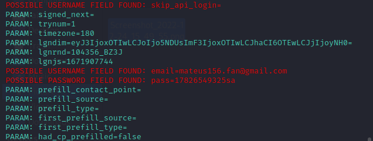

# Phishing para captura de senhas do Facebook

### Ferramentas

- Kali Linux
- setoolkit

### Configurando o Phishing no Kali Linux

- Acesso root: ``` sudo su ```
- Iniciando o setoolkit: ``` setoolkit ```
- Tipo de ataque: ``` Social-Engineering Attacks: 1 ```
- Vetor de ataque: ``` Web Site Attack Vectors: 2  ```
- Método de ataque: ```Credential Harvester Attack Method: 3 ```
- Método de ataque: ``` Site Cloner: 2 ```
- Obtendo o endereço da máquina: ``` ifconfig, gerealmente o setoolkit já coloca por padrão ```
- URL para clone: http://www.facebook.com

### Resutados

